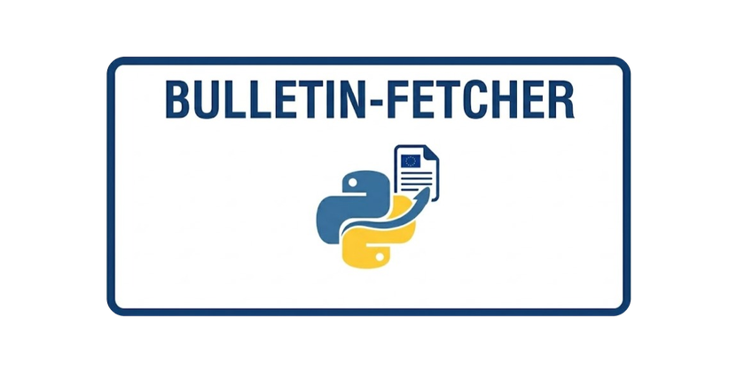

# bulletin-fetcher

bulletin-fetcher is a Python library for searching and managing official bulletins,
focused on the Official Journal of the European Union.

    

## Why bulletin-fetcher?

EU Official Journal acts can be queried through public semantic web infrastructure, but using the underlying SPARQL endpoint requires knowledge of RDF vocabularies, query structure and EUR-Lex metadata conventions and ontologies.

`bulletin-fetcher` abstracts this complexity behind a simple Python interface. Users can retrieve Official Journal acts by publication date, date ranges, act type, publishing institution and textual content, while receiving Python objects, JSON-compatible dictionaries, XML, CSV outputs or pandas DataFrames suitable for further analysis.

## Main features

- Search EU Official Journal acts from the Official Journal of the European Union.
- Filter acts by date or date range, act type, publishing institution, text contained in the act title, language.
- Fetch the content stream of an act by CELEX id or by the URI returned in search results.
- Retrieve available act types and publishing institutions.
- Return act search results as Python objects, JSON-compatible dictionaries, XML, CSV or pandas DataFrames.
- Work with Python instead of raw SPARQL queries.
- Integrate easily with notebooks, data pipelines and legal analytics workflows.

## Use Cases

bulletin-fetcher can be used for:

- Legal analytics
- Public policy research
- Regulatory monitoring
- Reproducible studies based on EU acts
- Data collection pipelines

## Citation

If you use bulletin-fetcher library in your work, please cite it as a software package.

- **Title:** bulletin-fetcher: A Python library for programmatic access to EU official bulletins
- **Author:** Diego González-Suárez
- **DOI:** 10.5281/zenodo.20156191

You can also find the full citation metadata in the repository citation file.
